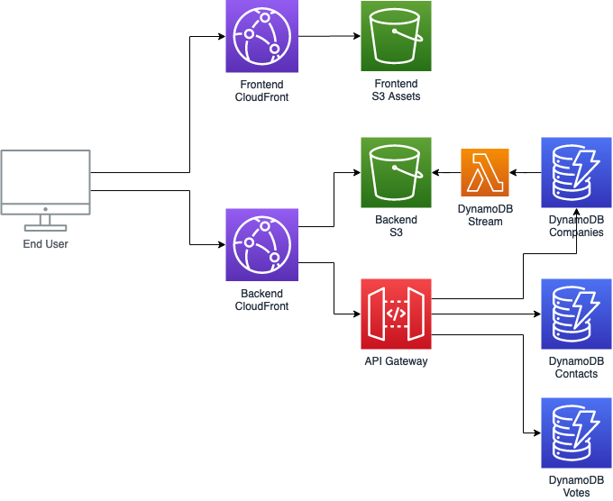

# wfh.vote

Simple serverless voting service for employees to anonymously vote on their work from home preferences in the context of their company.

See [wfh.vote](https://wfh.vote/) for a live example.

## Features

- Direct deployment via [AWS CloudFormation](https://aws.amazon.com/cloudformation/)
- Pipeline deployment via [AWS CodePipeline](https://aws.amazon.com/codepipeline/)
- Custom domain name support via [Amazon Route 53](https://aws.amazon.com/route53/) + automatic SSL via [AWS Certificate Manager](https://aws.amazon.com/certificate-manager/)

## Architecture



*Made using [draw.io](https://app.diagrams.net/), source file: [wfh.vote.drawio](docs/wfh.vote.drawio)*

## Prequisites

* [Git](https://git-scm.com/) (of course)
* [AWS Account](https://portal.aws.amazon.com/billing/signup#/), Optionally: [Route53 Public Hosted Zone](https://docs.aws.amazon.com/Route53/latest/DeveloperGuide/CreatingHostedZone.html)
* [AWS CLI](https://docs.aws.amazon.com/cli/latest/userguide/cli-configure-quickstart.html#cli-configure-quickstart-config), Optionally: [Git Credentials](https://docs.aws.amazon.com/codecommit/latest/userguide/setting-up-gc.html#setting-up-gc-iam)
* [Python 3](https://www.python.org/downloads/)
* Optionally: [SAM CLI](https://docs.aws.amazon.com/serverless-application-model/latest/developerguide/serverless-sam-cli-install.html)

## Getting started (customization)

Jot down answers to the following questions:

##### 1. What name should I use for the CodePipeline pipeline? (**`***CodePipelineName***`**)
##### 2. What name should I use for the CodeRepo repository? (**`***CodeRepoName***`**)
##### 3. (Optional) Do I want to use a custom domain for the frontend? (**`***CustomDomain***`**)
- What is the Route53 Zone ID where I can create this DNS record? (**`***CustomDomainZoneId***`**)
##### 4. (Optional) Do I want to use a custom domain for the backend votes API? (**`***CustomApiDomain***`**)
- What is the Route53 Zone ID where I can create this DNS record? (**`***CustomApiDomainZoneId***`**)
##### 5. (Optional) Do I want to add a custom environment name to the start of the frontend `<title>` tag? (**`***EnvironmentName***`**)


## Usage instructions:

##### 1. Clone the repo
```
git clone https://github.com/aaronbrighton/wfh.vote.git
```
##### 2. Deploy the pipeline stack (fill in the `***blanks***`)
Linux/Mac:
```
aws cloudformation create-stack --stack-name ***CodePipelineName*** \
--template-body file://pipeline-cf.yml --capabilities CAPABILITY_IAM --parameters \
ParameterKey=CodePipelineName,ParameterValue=***CodePipelineName*** \
ParameterKey=CodeRepoName,ParameterValue=***CodeRepoName*** \
ParameterKey=CustomDomain,ParameterValue=***CustomDomain*** \
ParameterKey=CustomDomainZoneId,ParameterValue=***CustomDomainZoneId*** \
ParameterKey=CustomApiDomain,ParameterValue=***CustomApiDomain*** \
ParameterKey=CustomApiDomainZoneId,ParameterValue=***CustomApiDomainZoneId*** \
ParameterKey=EnvironmentName,ParameterValue=***EnvironmentName***
```
Windows:
```
aws cloudformation create-stack --stack-name ***CodePipelineName*** --template-body file://pipeline-cf.yml --capabilities CAPABILITY_IAM --parameters "ParameterKey=CodePipelineName,ParameterValue=***CodePipelineName***" "ParameterKey=CodeRepoName,ParameterValue=***CodeRepoName***" "ParameterKey=CustomDomain,ParameterValue=***CustomDomain***" "ParameterKey=CustomDomainZoneId,ParameterValue=***CustomDomainZoneId***" "ParameterKey=CustomApiDomain,ParameterValue=***CustomApiDomain***" "ParameterKey=CustomApiDomainZoneId,ParameterValue=***CustomApiDomainZoneId***" "ParameterKey=EnvironmentName,ParameterValue=***EnvironmentName***"
```
##### 3. Periodically describe the pipeline stack until it's "StackStatus" is "CREATE_COMPLETE"
```
aws cloudformation describe-stacks --stack-name ***CodePipelineName***
```
##### 4. Make note of the "CodeCommitHTTPCloneUrl" output value once "StackStatus" is "CREATE_COMPLETE"
##### 5. Update your git config to use the new CodeCommit repository
Linux/Mac:
```
rm -rf .git
```
Windows:
```
rmdir .git /s
```
Linux/Mac/Windows:
```
git init
git remote add origin ***CodeCommitHTTPCloneUrl***
git add *
git commit -m "Initial commit"
git push --set-upstream origin master
```
##### 5. Periodically describe the pipeline until the stage "DeployFrontendStaticAssets" has a status of "Succeeded"
```
aws codepipeline get-pipeline-state --name ***CodePipelineName***
```
##### 6. Describe the frontend stack to get the URL for your live depoyment

```
aws cloudformation describe-stacks --stack-name CF-***CodePipelineName***-Frontend
```
##### 7. Make note of the "CloudFrontDistribution" output value, this is the URL to your live site!